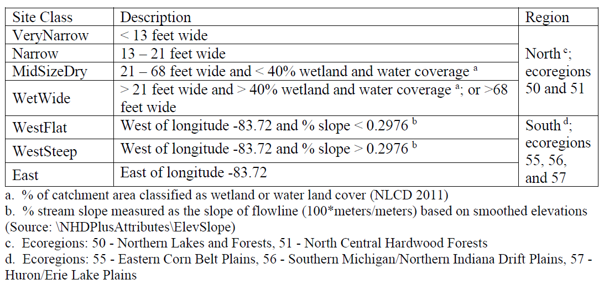

```{r setup, include=FALSE}
knitr::opts_chunk$set(echo = FALSE
                      , results = 'asis'
                      , warning = FALSE
                      , message = FALSE)
```

# Background

This web app calculates Index of Biotic Integrity (IBI) scores for
benthic macroinvertebrate assemblages in wadeable streams throughout
Michigan. The Michigan Department of Environment, Great Lakes, and
Energy (EGLE) has developed this IBI calculator app to efficiently
calculate IBI scores from macroinvertebrate samples.

Want to try running the calculator but don't have input files? Download
the
<a href="https://github.com/Blocktt/ShinyAppDocuments/tree/main/MIEGLEtools/Example_Files/" target="_blank">MI
EGLE Test Files</a>.

# Funding and acknowledgments

Section 106 funding allocated to MI EGLE by the USEPA funded the
development of this app.

# Intended application

The MI EGLE Macroinvertebrate IBIs improve the diagnostic ability of MI
EGLE scientists to identify degradation in biological integrity and
water quality. The IBIs are intended to be applied to samples that meet
the following criteria:

-   **Geographic area**: Wadeable streams in Michigan.

-   **Collection gear and method**: Triangular dip net with 1mm mesh or
    hand pick.

-   **Collection habitat**: All available habitats (both high and
    low-velocity areas) with consideration given to proportional
    occurrence. Preference is given to gravel, cobble and boulder
    substrates.

-   **Index period**: June - September.

-   **Sampling effort**: Approximately 20 minutes of total sampling
    time.

-   **Taxonomic resolution**: Macroinvertebrates identified to family or
    higher.

-   **Subsampling**: A composite sample is subsampled in the field to
    obtain 300 +/- 60 organisms for identification and enumeration.

# Index Classes

Appropriate stream classification ensures that the index calibrated for
a stream type gives the most reliable community assessment information.
For each site, the stream class will be identified according to
specifications in the table below. Once a site is sampled using
Procedure 51, the stream class is determined and then generally retained
for future monitoring events. This prevents a site from switching class
based on a small difference in stream width.

The north region includes:

-   Northern Lakes and Forests

-   North Central Hardwood Forests

The south region includes:

-   Huron/Erie Lake Plains

-   Eastern Corn Belt Plains

-   Southern Michigan/Northern Indiana Drift Plains

<center>{width="65%"}</center>

# Macroinvertebrate Models

Metric calculation depends on the list of taxa collected, taxa traits,
and calculation descriptions. Each stream class has a specific index
that includes a unique set of metrics and scoring formulae (see tables
below). Metric scores are first calculated from metric values. Any
scores calculated as \>100 are reset to 100 and scores calculated to \<0
are reset to 0. The calculated and reset scores are averaged across all
metrics to arrive at an index score for each site.

## Very Narrow Index Class

```{r Very Narrow}
# Packages
library(readxl)
library(knitr)
library(dplyr)
library(kableExtra)

# Data
fn_data <- "OutputFileSubtabs.xlsx"
path_data <- file.path("files", fn_data)
df_data <- read_excel(path_data, sheet = "FileBuild_About")
df_data_trim <- df_data %>% 
  filter(`Index Class` == "VeryNarrow") %>% 
  select(-c(`Index Class`))

# Display
options(knitr.kable.NA = '')
df_data_trim %>%
  kable() %>%
  kable_styling(full_width = F, position = "center") %>%
  row_spec(0, extra_css = "border-top: 2px solid black; border-bottom: 1px solid black;") %>%
  row_spec(1:(nrow(df_data_trim) - 1), extra_css = "border-bottom: 1px solid black;") %>%
  row_spec(nrow(df_data_trim), extra_css = "border-bottom: 2px solid black;")
```

## Narrow Index Class

```{r Narrow}
# Packages
library(readxl)
library(knitr)
library(dplyr)

# Data
fn_data <- "OutputFileSubtabs.xlsx"
path_data <- file.path("files", fn_data)
df_data <- read_excel(path_data, sheet = "FileBuild_About")
df_data_trim <- df_data %>% 
  filter(`Index Class` == "Narrow") %>% 
  select(-c(`Index Class`))

# Display
options(knitr.kable.NA = '')
df_data_trim %>%
  kable() %>%
  kable_styling(full_width = F, position = "center") %>%
  row_spec(0, extra_css = "border-top: 2px solid black; border-bottom: 1px solid black;") %>%
  row_spec(1:(nrow(df_data_trim) - 1), extra_css = "border-bottom: 1px solid black;") %>%
  row_spec(nrow(df_data_trim), extra_css = "border-bottom: 2px solid black;")
```

## Mid-Size Dry Index Class

```{r MSD}
# Packages
library(readxl)
library(knitr)
library(dplyr)

# Data
fn_data <- "OutputFileSubtabs.xlsx"
path_data <- file.path("files", fn_data)
df_data <- read_excel(path_data, sheet = "FileBuild_About")
df_data_trim <- df_data %>% 
  filter(`Index Class` == "MidSizeDry") %>% 
  select(-c(`Index Class`))

# Display
options(knitr.kable.NA = '')
df_data_trim %>%
  kable() %>%
  kable_styling(full_width = F, position = "center") %>%
  row_spec(0, extra_css = "border-top: 2px solid black; border-bottom: 1px solid black;") %>%
  row_spec(1:(nrow(df_data_trim) - 1), extra_css = "border-bottom: 1px solid black;") %>%
  row_spec(nrow(df_data_trim), extra_css = "border-bottom: 2px solid black;")
```

## Wet/Wide Index Class

```{r wetWide}
# Packages
library(readxl)
library(knitr)
library(dplyr)

# Data
fn_data <- "OutputFileSubtabs.xlsx"
path_data <- file.path("files", fn_data)
df_data <- read_excel(path_data, sheet = "FileBuild_About")
df_data_trim <- df_data %>% 
  filter(`Index Class` == "WetWide") %>% 
  select(-c(`Index Class`))

# Display
options(knitr.kable.NA = '')
df_data_trim %>%
  kable() %>%
  kable_styling(full_width = F, position = "center") %>%
  row_spec(0, extra_css = "border-top: 2px solid black; border-bottom: 1px solid black;") %>%
  row_spec(1:(nrow(df_data_trim) - 1), extra_css = "border-bottom: 1px solid black;") %>%
  row_spec(nrow(df_data_trim), extra_css = "border-bottom: 2px solid black;")
```

## West Flat Index Class

```{r WestFlat}
# Packages
library(readxl)
library(knitr)
library(dplyr)

# Data
fn_data <- "OutputFileSubtabs.xlsx"
path_data <- file.path("files", fn_data)
df_data <- read_excel(path_data, sheet = "FileBuild_About")
df_data_trim <- df_data %>% 
  filter(`Index Class` == "WestFlat") %>% 
  select(-c(`Index Class`))

# Display
options(knitr.kable.NA = '')
df_data_trim %>%
  kable() %>%
  kable_styling(full_width = F, position = "center") %>%
  row_spec(0, extra_css = "border-top: 2px solid black; border-bottom: 1px solid black;") %>%
  row_spec(1:(nrow(df_data_trim) - 1), extra_css = "border-bottom: 1px solid black;") %>%
  row_spec(nrow(df_data_trim), extra_css = "border-bottom: 2px solid black;")
```

## West Steep Index Class

```{r WestSteep}
# Packages
library(readxl)
library(knitr)
library(dplyr)

# Data
fn_data <- "OutputFileSubtabs.xlsx"
path_data <- file.path("files", fn_data)
df_data <- read_excel(path_data, sheet = "FileBuild_About")
df_data_trim <- df_data %>% 
  filter(`Index Class` == "WestSteep") %>% 
  select(-c(`Index Class`))

# Display
options(knitr.kable.NA = '')
df_data_trim %>%
  kable() %>%
  kable_styling(full_width = F, position = "center") %>%
  row_spec(0, extra_css = "border-top: 2px solid black; border-bottom: 1px solid black;") %>%
  row_spec(1:(nrow(df_data_trim) - 1), extra_css = "border-bottom: 1px solid black;") %>%
  row_spec(nrow(df_data_trim), extra_css = "border-bottom: 2px solid black;")
```

## East Index Class

```{r East}
# Packages
library(readxl)
library(knitr)
library(dplyr)

# Data
fn_data <- "OutputFileSubtabs.xlsx"
path_data <- file.path("files", fn_data)
df_data <- read_excel(path_data, sheet = "FileBuild_About")
df_data_trim <- df_data %>% 
  filter(`Index Class` == "East") %>% 
  select(-c(`Index Class`))

# Display
options(knitr.kable.NA = '')
df_data_trim %>%
  kable() %>%
  kable_styling(full_width = F, position = "center") %>%
  row_spec(0, extra_css = "border-top: 2px solid black; border-bottom: 1px solid black;") %>%
  row_spec(1:(nrow(df_data_trim) - 1), extra_css = "border-bottom: 1px solid black;") %>%
  row_spec(nrow(df_data_trim), extra_css = "border-bottom: 2px solid black;")
```

# Interpretation

Previous versions of Procedure 51 scoring and thresholds were developed
to classify macroinvertebrate communities into either “excellent,”
“acceptable,” or “poor” categories. This update to the Procedure 51 MMI,
including new stream classes and taking an updated reference site
approach to anchoring community expectations, enables development of
protective thresholds that can be used to identify departure from
expected conditions. This updated Procedure 51 MMI scoring system
determines if a macroinvertebrate community “meets expectations” or does
“not meet expectations.” “Not meeting expectations” is an indicator that
water quality, stream habitat, or other conditions are impacting the
biological community.

With the goal of using macroinvertebrate communities as an indication of
stream function and the influence of human impacts, the Procedure 51 MMI
uses a minimally-impacted reference site approach to set
macroinvertebrate community expectations for each stream class. Within
Michigan, two centuries of extensive land use change and resource
extraction, along with local and global atmospheric impacts, results in
some level of environmental impact at all sites, even minimally-impacted
reference sites.

Based on this widespread human influence, a percentile of the reference
site scores was used to identify a Procedure 51 score that indicates
community deviation from reference condition. There is inherent
variability in reference condition and error associated with the process
of picking reference sites. Though efforts were made to select
meaningful variables while reducing redundancy, Michigan’s reference
sites were chosen using a subset of possible catchment- and
watershed-scale variables, leaving room for potentially unaccounted for
impacts, possibly resulting in sites with some unexpected anthropogenic
impacts. Eliminating the lower end of the reference site distribution
from the “meeting expectations” range reduces the risk of considering a
site to ‘meet expectations’ when it does not. However, the higher the
threshold is placed within the range of reference site scores, the more
likely a water body could be classified as ‘not meeting expectations’
when it may in fact be “meeting expectations.” Choosing a threshold was
a balance between these two types of risk.

To help inform threshold placement for each stream class, prior
knowledge of extreme conditions was used (i.e., sites rated poor and
excellent using previous versions of Procedure 51) with the intent of
continuing to consider sites that used to score excellent to ‘meet
expectations’ and that sites that historically scored poor would also
‘not meet expectations’ under the new scoring system. Using this
approach resulted in thresholds ranging from the 5th to 15th percentile
of reference. The table below presents Procedure 51 thresholds and
reference site percentile for each stream class.

```{r Thresholds}
# Packages
library(readxl)
library(knitr)

# Data
fn_data <- "OutputFileSubtabs.xlsx"
path_data <- file.path("files", fn_data)
df_data <- read_excel(path_data, sheet = "FileBuild_About2")

# Display
options(knitr.kable.NA = '')
df_data %>%
  kable() %>%
  kable_styling(full_width = F, position = "center") %>%
  row_spec(0, extra_css = "border-top: 2px solid black; border-bottom: 1px solid black;") %>%
  row_spec(1:(nrow(df_data) - 1), extra_css = "border-bottom: 1px solid black;") %>%
  row_spec(nrow(df_data), extra_css = "border-bottom: 2px solid black;")
```
